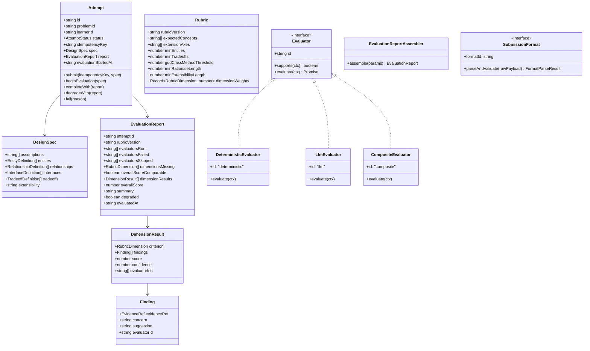
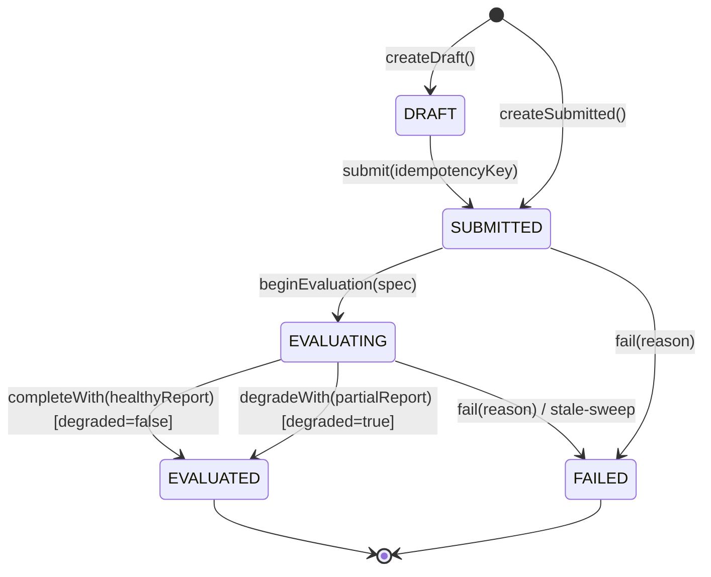

# Architecture & System Design

## 1. MVP Scope & User Flow

The **LLD Practice Platform** provides a deliberate practice experience for Low-Level Design. The user flow follows a tight, explainable loop:

```
[Choose Problem] ➔ [Inspect Context & Rubric] ➔ [Author Structured Spec] 
       ➔ [Submit (Async 201)] ➔ [Poll Status (202)] ➔ [Review Grounded Report (200)] 
       ➔ [Inspect History & Deltas] ➔ [Address Recurring Weaknesses]
```

### Core Constraints & Non-Goals
- **Scope Boundary**: Pure domain-focused LLD monolith. No microservices, no message queues, no multi-region replication.
- **Submission Format**: Structured text only. Code/diagram submission is an extension point behind `SubmissionFormat`.
- **Evaluation**: Hybrid (Deterministic heuristics + LLM judgment), both emitting the exact same report contract.

---

## 2. Layering & Clean Architecture

The codebase enforces strict inward-pointing dependencies verified by automated boundary tests:

```
src/domain/         ➔ Pure models, state machine, value objects, domain interfaces (ZERO external imports)
src/application/    ➔ Orchestration services, evaluation engines, assemblers, learning loops
src/infrastructure/ ➔ SQLite storage, LLM clients, seed data, Express endpoints, DTO mappers
src/web/            ➔ React + Vite client (practice UI, polling indicator, delta viewer)
```

### Justification of Abstractions
Every abstraction in the system serves a specific, documented architectural purpose:
- **`SubmissionFormat` (Factory Pattern)**: Normalizes arbitrary input formats into canonical `DesignSpec` so evaluators remain completely decoupled from submission mechanics (solves Change Test A).
- **`Evaluator` (Strategy Pattern)**: Enables pluggable, independent evaluation strategies that operate concurrently on the canonical spec (solves Change Test B).
- **`CompositeEvaluator` (Composite Pattern)**: Combines multiple evaluator strategies, merges dimensions via confidence weighting, and degrades gracefully when a member fails.
- **`AttemptRepository` (Repository Pattern)**: Isolates domain aggregates from persistence mechanics, enabling SQLite in production and in-memory stores in unit tests.
- **`Clock` (Service Pattern)**: Injects deterministic time control across aggregates and report assemblers, eliminating race conditions in timeout tests.

---

## 3. Mermaid Class Diagram



---

## 4. Evaluation Strategy: Deterministic vs. LLM Split

| Rubric Dimension | Evaluated By & Role | Mechanism / Heuristic | Evidence Citation (`sourcePath`) |
| :--- | :--- | :--- | :--- |
| **requirementUnderstanding** | LLM-primary / deterministic-guard | Tokenized concept coverage guard matching `rubric.expectedConcepts` & `minEntities`. LLM assesses requirement depth and domain modeling. | `entities[i].name` or `absenceRef("expectedConcepts")` |
| **classResponsibilities** | Deterministic-primary / LLM-advisory | God-class check (`methods.length > threshold`) and multi-duty conjunction detector (`manages ... and processes`). LLM evaluates nuanced SRP boundaries. | `entities[i].methods` or `entities[i].responsibility` |
| **couplingCohesion** | Deterministic-primary / LLM-advisory | Orphan entity detector (entities absent from all relationships). LLM evaluates coupling appropriateness. | `entities[i].name` or `relationships[i]` |
| **encapsulationInterfaces** | Deterministic-primary / LLM-advisory | Anemic domain model detector (entities with attributes but 0 methods). LLM reviews encapsulation boundaries and method signatures. | `entities[i].attributes` |
| **abstractionPatterns** | Deterministic-primary / LLM-advisory | Missing abstraction detector for declared `rubric.extensionAxes` (checks for matching interface or hierarchy). LLM reviews design pattern appropriateness. | `interfaces[i].name` or `absenceRef("interfaces")` |
| **extensibility** | LLM-primary / deterministic-guard | Character length check on `extensibility` narrative against `rubric.minExtensibilityLength` (acts strictly as a presence guard, not a quality signal; note that it rewards verbosity). LLM performs primary evaluation of how cleanly the design absorbs anticipated change. | `extensibility` |
| **edgeCasesTestability** | LLM-primary / deterministic-guard | Guard for non-empty `assumptions` and boundary constraints. LLM assesses failure modes, concurrent race conditions, and testability. | `assumptions[i]` or `absenceRef("assumptions")` |
| **explanationQuality** | LLM-primary / deterministic-guard | Guard for `minTradeoffs` count and `minRationaleLength`. LLM assesses depth of technical reasoning and trade-off justification. | `tradeoffs[i].why` or `absenceRef("tradeoffs")` |

### When Evaluators Disagree

When both `DeterministicEvaluator` and `LlmEvaluator` evaluate the same rubric dimension, the system resolves discrepancies using the following policy:

- **Chosen Policy: Confidence-Weighted Averaging**:
  Each candidate score (on the Zod-enforced 0..5 scale) is weighted by $\max(0.1, \text{confidence}_i)$:
  $$\text{Score}_{\text{merged}} = \frac{\sum (\text{score}_i \times \max(0.1, \text{confidence}_i))}{\sum \max(0.1, \text{confidence}_i)}$$
  All findings from both evaluators are aggregated into the dimension's `findings` array, preserving their originating `evaluatorId` and `EvidenceRef` citations.

- **Concrete Failure Mode**:
  Consider a concrete scenario on `classResponsibilities`:
  - `DeterministicEvaluator` flags a 9-method God class: score **2.0** at confidence **1.0** (weight = 1.0).
  - `LlmEvaluator` takes a generous view of the entity's high-level role: score **4.5** at confidence **0.8** (weight = 0.8).
  - The weighted average produces **3.1**:
    $$\text{Score}_{\text{merged}} = \frac{(2.0 \times 1.0) + (4.5 \times 0.8)}{1.0 + 0.8} = \frac{2.0 + 3.6}{1.8} = \frac{5.6}{1.8} \approx 3.1$$
  - **Why 3.1 is unhelpful to the learner**: A score of 3.1 sits in an uninformative, lukewarm middle ground. It dilutes the severe, actionable diagnostic signal of the concrete structural violation (a 2.0 God class that would fail an LLD interview) while simultaneously penalizing the learner's otherwise sound conceptual design that the LLM rated 4.5. Instead of learning that they have an isolated, critical structural issue to fix, the learner receives an ambiguous passing grade suggesting mediocrity across the board.

- **Rejected Alternative: Authority Partitioning**:
  We considered making the deterministic engine strictly authoritative for structural dimensions (`classResponsibilities`, `couplingCohesion`, `encapsulationInterfaces`, `abstractionPatterns`) and the LLM authoritative solely for qualitative judgment dimensions (`requirementUnderstanding`, `extensibility`, `edgeCasesTestability`, `explanationQuality`).
  
- **Reason for Rejection**:
  Strict authority partitioning completely silences qualitative LLM insights on structural design. An LLM can recognize when an apparent "God class" is legitimately aggregating cohesive domain behaviors or suggest a specific design pattern (e.g., State or Strategy) to refactor it. Rather than discarding one evaluator's perspective, confidence-weighted averaging retains full visibility of all findings, ensuring the learner sees the high-confidence deterministic violation explicitly flagged with its citation alongside the LLM's actionable architectural suggestions.

---

## 5. The Two Change Tests

### Change Test A: Move from Structured Text to Class Diagrams or Code
> *Question: Today text submission; later a class diagram. How much of the domain changes?*
- **Domain Impact**: **Partial domain impact (not 0%)**.
- **Analysis**:
  - Structural dimensions (`entities`, `relationships`, `interfaces`) port cleanly at zero domain cost: a class diagram parser (e.g. Mermaid or PlantUML) can be implemented as a new `SubmissionFormat` that maps diagram nodes and edges into `DesignSpec.entities`, `relationships`, and `interfaces`.
  - However, a visual class diagram **cannot express non-structural dimensions**: learner assumptions, design trade-offs, or an extensibility narrative. 
  - Consequently, supporting class diagrams requires one of two architectural choices:
    1. *Make non-structural fields optional in `DesignSpec`*: Change `assumptions?: string[]`, `tradeoffs?: TradeoffDefinition[]`, `extensibility?: string`. This is a real domain change that introduces undefined guards across all evaluators.
    2. *Introduce per-format dimension applicability in the Rubric*: Allow the `Rubric` to declare which dimensions apply to a given format (e.g. `applicableDimensions(formatId)`). Evaluators skip inapplicable dimensions, recording them in `dimensionsMissing` and marking `overallScoreComparable: false`.
  - **Chosen Option & Rationale**: We would pick **Option 2 (Per-Format Dimension Applicability in the Rubric)**. Making domain spec fields optional pollutes the core aggregate with partial states and invites runtime null checks everywhere. Making applicability a property of the rubric/evaluation policy truthfully reflects reality: a class diagram format legitimately tests structural syntax and relationships, but leaves trade-off justification to text or interview dialogue.

### Change Test B: Adding a Rule-Based Evaluator or Human Review
> *Question: Today one evaluator; later a rule-based evaluator or human review. Can you add it?*
- **Domain Impact**: **Zero domain cost for synchronous evaluators; real architectural extension required for asynchronous human review (not 0%)**.
- **Analysis**:
  - *Synchronous Evaluators (AST linters, static rule checkers)*: Fit the `Evaluator` port seamlessly at zero domain cost. Any in-process engine implementing `id`, `supports(ctx)`, and `evaluate(ctx)` can be registered into `CompositeEvaluator` without touching domain models or services.
  - *Asynchronous Human Review Does NOT Fit the Current Port*: The current `Evaluator.evaluate()` contract returns a `Promise<EvaluatorOutput>` governed by a per-evaluator timeout (default 15 seconds) inside an automated background loop. A human mentor reviewing a design over hours or days will always breach the 15s timeout, land in `evaluatorsFailed`, and produce a permanently `degraded: true` report.
  - **Required Extension Shape (Report Amendment Path)**:
    Supporting human review requires introducing an asynchronous report-amendment lifecycle:
    1. An initial evaluation completes via automated evaluators (`AttemptStatus = 'EVALUATED'`).
    2. A new domain method `attempt.amendWith(humanDimensionResults, rubricVersion)` allows a late-arriving human review to attach or override specific dimensions on an already-evaluated attempt.
    3. A `rubricVersion` guard ensures that if the problem's rubric was updated while the human review was pending, the amendment is rejected or flagged as non-comparable.

---

## 6. State Machine & Lifecycle Transitions

The `Attempt` aggregate root strictly enforces valid lifecycle state transitions:



### Invariants & Lifecycle Semantics

- **Idempotent Resubmissions**:
  - When `EvaluationService.submitAttempt()` receives a submission whose `idempotencyKey` matches an existing attempt:
    - If the `rawSubmission` payload is identical, it safely replays the existing attempt: returns HTTP `200 OK` with `{ outcome: 'accepted', attemptId: existing.id, status: existing.status, isReplay: true }` without creating a duplicate attempt or re-triggering evaluation.
    - If the `idempotencyKey` matches but the `rawSubmission` payload differs, the service rejects the request with `IdempotencyPayloadMismatchError` (HTTP `409 Conflict`), preventing payload corruption under key reuse.
- **State Invariants**:
  - An attempt cannot transition from `EVALUATED` back to `EVALUATING` or `SUBMITTED`.
  - `report` is guaranteed to exist only on `EVALUATED`.
  - `errorMessage` is guaranteed to exist only on `FAILED`.
  - `completeWith()` asserts that `report.degraded === false` to guarantee no false healthy states.
  - `degradeWith()` asserts that `report.degraded === true`.
  - Attempt submissions are saved to the database **before** evaluation begins, ensuring persistence even if an evaluator or the server crashes.
- **Evaluation Report Completeness Semantics**:
  - `dimensionsMissing: readonly RubricDimension[]`: Explicitly enumerates any of the 8 rubric dimensions for which all supporting evaluators failed (e.g. timed out) or were skipped.
  - `overallScoreComparable: boolean`: Indicates whether the report's `overallScore` can be fairly compared against baseline scores or other attempts in the learning loop. It is set to `true` if and only if `dimensionsMissing.length === 0`. If any dimension is missing, `overallScoreComparable` is `false`, ensuring that incomplete evaluations do not distort score delta calculations or longitudinal trend analysis.

---

## 7. Key Tradeoffs & Technical Decisions

1. **Structured JSON vs. Freeform Prose**:
   - *Tradeoff*: Constraining the learner to structured sections reduces freeform stylistic expression.
   - *Decision*: Adopted structured text because it provides deterministic anchors for syntactic heuristics, enables honest quote/path citations, and prevents generic LLM hallucinations.
2. **Confidence-Weighted Averaging vs. Winner-Takes-All Merging**:
   - *Tradeoff*: Averaging scores between deterministic rules and LLM judgement can slightly soften a severe rule penalty.
   - *Decision*: Adopted confidence-weighted averaging with accumulated findings. The learner sees both the rule-based structural violation and the qualitative LLM feedback side-by-side with clear contributor badges.
3. **In-Process Async Evaluation vs. Distributed Queue (RabbitMQ / BullMQ / Celery)**:
   - *Tradeoff*: In-process evaluation lives in the Node.js event loop; process restarts require a recovery sweep.
   - *Decision*: Chosen intentionally to adhere strictly to the monolith scope boundary. Added a resilient `recoverStaleEvaluations()` sweep that automatically reclaims orphaned evaluations on startup.

---

## 8. Limitations & What I'd Do Next

1. **No Real Authentication**:
   - *Current Limitation*: Learner identity is passed via an arbitrary string (`learnerId: "learner-alex"`).
   - *Next Step*: Introduce JWT-based session authentication with OAuth2 providers (GitHub/Google).
2. **Single-Process Evaluation & Worker Scalability**:
   - *Current Limitation*: Background evaluation runs within the Express application event loop via non-blocking promises. Under extreme concurrent load, heavy LLM calls could saturate server resources.
   - *Next Step*: Offload evaluation jobs to background worker processes using a lightweight Redis-backed queue or SQLite WAL-based task queue without violating simplicity.
3. **Substring & Stemming-Based Concept Coverage**:
   - *Current Limitation*: Syntactic tokenization and plural stripping can produce false positives (e.g. "spotlight" matching "spot") or false negatives for novel synonyms.
   - *Next Step*: Supplement stemming with a lightweight local embedding similarity check or WordNet synset matching for domain synonyms.

---

## 9. Scalability Evolution

> *"If this platform grows, the first component I would extract is the **Evaluation Engine (CompositeEvaluator + Evaluator Workers)** into an asynchronous worker pool, because LLM evaluation latencies (3-15 seconds) and external network timeouts should be isolated from the core learner submission and problem browsing HTTP endpoints."*
