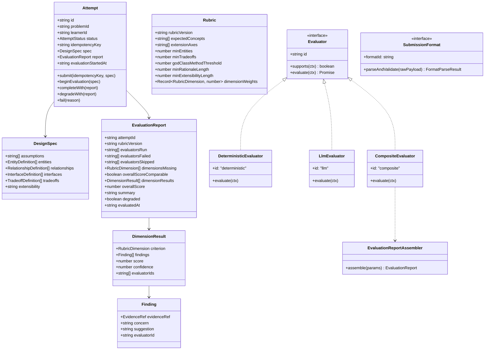
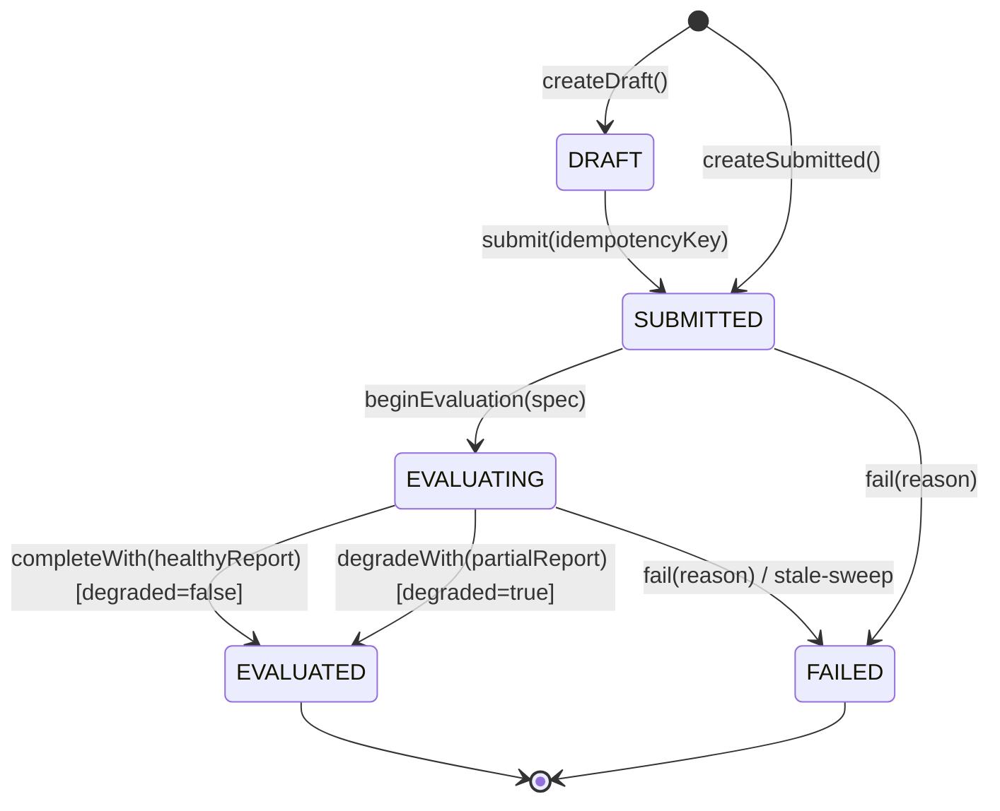

# Architecture & System Design

## 1. MVP Scope & User Flow

The **LLD Practice Platform** provides a deliberate practice experience for Low-Level Design. The user flow follows a tight, explainable loop:

```
[Choose Problem] ➔ [Inspect Context & Rubric] ➔ [Author Structured Spec] 
       ➔ [Submit (Async 201)] ➔ [Poll Status (202)] ➔ [Review Grounded Report (200)] 
       ➔ [Inspect History & Deltas] ➔ [Address Recurring Weaknesses]
```

### Core Constraints & Non-Goals
- **Scope Boundary**: Pure domain-focused LLD monolith. No microservices, no message queues, no multi-region replication.
- **Submission Format**: Structured text only. Code/diagram submission is an extension point behind `SubmissionFormat`.
- **Evaluation**: Hybrid (Deterministic heuristics + LLM judgment), both emitting the exact same report contract.

---

## 2. Layering & Clean Architecture

The codebase enforces strict inward-pointing dependencies verified by automated boundary tests:

```
src/domain/         ➔ Pure models, state machine, value objects, domain interfaces (ZERO external imports)
src/application/    ➔ Orchestration services, evaluation engines, assemblers, learning loops
src/infrastructure/ ➔ SQLite storage, LLM clients, seed data, Express endpoints, DTO mappers
src/web/            ➔ React + Vite client (practice UI, polling indicator, delta viewer)
```

### Justification of Abstractions
Every abstraction in the system serves a specific, documented architectural purpose:
- **`SubmissionFormat` (Factory Pattern)**: Normalizes arbitrary input formats into canonical `DesignSpec` so evaluators remain completely decoupled from submission mechanics (solves Change Test A).
- **`Evaluator` (Strategy Pattern)**: Enables pluggable, independent evaluation strategies that operate concurrently on the canonical spec (solves Change Test B).
- **`CompositeEvaluator` (Composite Pattern)**: Combines multiple evaluator strategies, merges dimensions via confidence weighting, and degrades gracefully when a member fails.
- **`AttemptRepository` (Repository Pattern)**: Isolates domain aggregates from persistence mechanics, enabling SQLite in production and in-memory stores in unit tests.
- **`Clock` (Service Pattern)**: Injects deterministic time control across aggregates and report assemblers, eliminating race conditions in timeout tests.

---

## 3. Mermaid Class Diagram



---

## 4. Evaluation Strategy: Deterministic vs. LLM Split

| Rubric Dimension | Evaluated By | Mechanism / Heuristic | Evidence Citation (`sourcePath`) |
| :--- | :--- | :--- | :--- |
| **requirementUnderstanding** | Deterministic + LLM | Tokenized concept coverage matching `rubric.expectedConcepts` & `minEntities` guard. LLM assesses requirement depth. | `entities[i].name` or `absenceRef("expectedConcepts")` |
| **classResponsibilities** | Deterministic + LLM | God-class check (`methods.length > threshold`) and multi-duty conjunction detector (`manages ... and processes`). LLM evaluates SRP nuances. | `entities[i].methods` or `entities[i].responsibility` |
| **couplingCohesion** | Deterministic + LLM | Orphan entity detector (entities absent from all relationships). LLM evaluates coupling appropriateness. | `entities[i].name` or `relationships[i]` |
| **encapsulationInterfaces** | Deterministic + LLM | Anemic domain model detector (entities with attributes but 0 methods). LLM reviews encapsulation boundaries. | `entities[i].attributes` |
| **abstractionPatterns** | Deterministic + LLM | Missing abstraction detector for declared `rubric.extensionAxes` (checks for matching interface or hierarchy). LLM reviews pattern appropriateness. | `interfaces[i].name` or `absenceRef("interfaces")` |
| **extensibility** | Deterministic + LLM | Minimum length check on `extensibility` narrative against `rubric.minExtensibilityLength`. LLM reviews how easily design absorbs change. | `extensibility` |
| **edgeCasesTestability** | Deterministic + LLM | Guard for non-empty `assumptions` and boundary constraints. LLM reviews failure modes. | `assumptions[i]` or `absenceRef("assumptions")` |
| **explanationQuality** | Deterministic + LLM | Guard for `minTradeoffs` count and `minRationaleLength`. LLM assesses technical trade-off depth. | `tradeoffs[i].why` or `absenceRef("tradeoffs")` |

---

## 5. The Two Change Tests

### Change Test A: Move from Structured Text to Class Diagrams or Code
> *Question: Today text submission; later a class diagram. How much of the domain changes?*
- **Domain Impact**: **0%**. Zero domain code changes.
- **How It Works**: The entire evaluation pipeline (heuristics, LLM evaluator, composite aggregation, report assembler) depends exclusively on the canonical `DesignSpec`. A class diagram parser (e.g. Mermaid or PlantUML) or AST code parser is simply implemented as a new `SubmissionFormat` (e.g. `ClassDiagramFormat : SubmissionFormat`). Once normalized to `DesignSpec`, the evaluation proceeds identically.

### Change Test B: Adding a Rule-Based Evaluator or Human Review
> *Question: Today one evaluator; later a rule-based evaluator or human review. Can you add it?*
- **Domain Impact**: **0%**. Zero changes to existing evaluators or orchestration logic.
- **How It Works**: Every evaluation engine implements `Evaluator`. Adding a human review evaluator or static linter requires implementing `HumanReviewEvaluator : Evaluator`. Registering it into `CompositeEvaluator` automatically includes its dimension results in confidence-weighted merging, records its execution in `evaluatorsRun`, and degrades gracefully if it is skipped or fails.

---

## 6. State Machine & Lifecycle Transitions

The `Attempt` aggregate root strictly enforces valid lifecycle state transitions:



### Invariants Enforced
- An attempt cannot transition from `EVALUATED` back to `EVALUATING` or `SUBMITTED`.
- `report` is guaranteed to exist only on `EVALUATED`.
- `errorMessage` is guaranteed to exist only on `FAILED`.
- `completeWith()` asserts that `report.degraded === false` to guarantee no false healthy states.
- `degradeWith()` asserts that `report.degraded === true`.
- Attempt submissions are saved to the database **before** evaluation begins, ensuring persistence even if an evaluator or the server crashes.

---

## 7. Key Tradeoffs & Technical Decisions

1. **Structured JSON vs. Freeform Prose**:
   - *Tradeoff*: Constraining the learner to structured sections reduces freeform stylistic expression.
   - *Decision*: Adopted structured text because it provides deterministic anchors for syntactic heuristics, enables honest quote/path citations, and prevents generic LLM hallucinations.
2. **Confidence-Weighted Averaging vs. Winner-Takes-All Merging**:
   - *Tradeoff*: Averaging scores between deterministic rules and LLM judgement can slightly soften a severe rule penalty.
   - *Decision*: Adopted confidence-weighted averaging with accumulated findings. The learner sees both the rule-based structural violation and the qualitative LLM feedback side-by-side with clear contributor badges.
3. **In-Process Async Evaluation vs. Distributed Queue (RabbitMQ / BullMQ / Celery)**:
   - *Tradeoff*: In-process evaluation lives in the Node.js event loop; process restarts require a recovery sweep.
   - *Decision*: Chosen intentionally to adhere strictly to the monolith scope boundary. Added a resilient `recoverStaleEvaluations()` sweep that automatically reclaims orphaned evaluations on startup.

---

## 8. Limitations & What I'd Do Next

1. **No Real Authentication**:
   - *Current Limitation*: Learner identity is passed via an arbitrary string (`learnerId: "learner-alex"`).
   - *Next Step*: Introduce JWT-based session authentication with OAuth2 providers (GitHub/Google).
2. **Single-Process Evaluation & Worker Scalability**:
   - *Current Limitation*: Background evaluation runs within the Express application event loop via non-blocking promises. Under extreme concurrent load, heavy LLM calls could saturate server resources.
   - *Next Step*: Offload evaluation jobs to background worker processes using a lightweight Redis-backed queue or SQLite WAL-based task queue without violating simplicity.
3. **Substring & Stemming-Based Concept Coverage**:
   - *Current Limitation*: Syntactic tokenization and plural stripping can produce false positives (e.g. "spotlight" matching "spot") or false negatives for novel synonyms.
   - *Next Step*: Supplement stemming with a lightweight local embedding similarity check or WordNet synset matching for domain synonyms.

---

## 9. Scalability Evolution

> *"If this platform grows, the first component I would extract is the **Evaluation Engine (CompositeEvaluator + Evaluator Workers)** into an asynchronous worker pool, because LLM evaluation latencies (3-15 seconds) and external network timeouts should be isolated from the core learner submission and problem browsing HTTP endpoints."*
